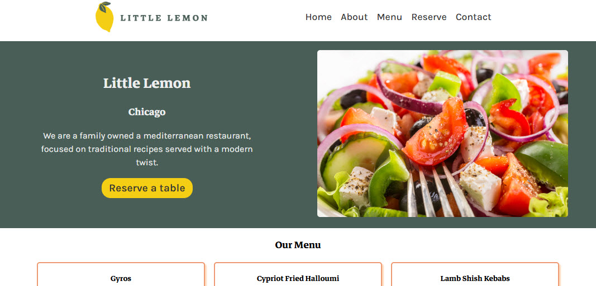
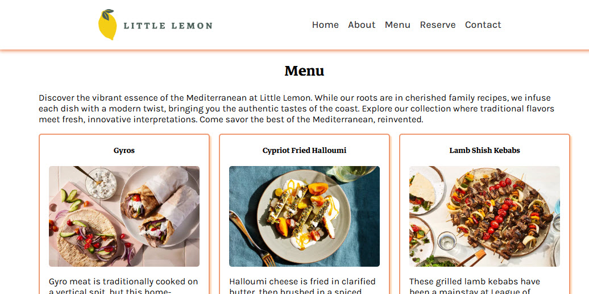
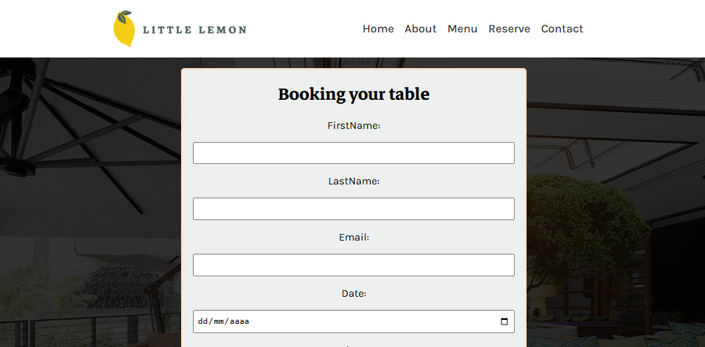
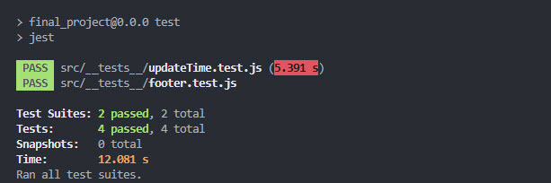

# Little Lemon
### Capstone project  / Meta Front-End Development Specialization

The React app is built with Vite. It features a responsive design, form validation, and simulated API interactions for reservations.

Visit the page : https://ramirezjm.github.io/Little_Lemon_Meta_Capstone/

[](https://choosealicense.com/licenses/mit/)


<div>

</div>
<div>

</div>
<div>

</div>
<div>

</div>

## Getting Started

Follow these steps to get the project up and running on your local machine.

### Prerequisites

Make sure you have [Node.js](https://nodejs.org/en/download/) installed. I used the version 22.14.0 (which includes npm).

1.  **Clone the repository:**
    ```bash
    git clone [YOUR_REPOSITORY_URL_HERE]
    cd [YOUR_PROJECT_FOLDER_NAME] # e.g., cd final_project
    ```
    *(Remember to replace `[YOUR_REPOSITORY_URL_HERE]` and `[YOUR_PROJECT_FOLDER_NAME]` with your actual repo URL and project directory name.)*

2.  **Install dependencies:**
    ```bash
    npm install
    ```
    This command will install all the necessary packages listed in `package.json`.

---

## Running the Application

To start the development server and view the application locally:

```bash
npm run dev
```

## Running Tests

To execute the project's test suite (powered by Jest and React Testing Library):

```bash
npm test
```

This will run all tests and display the results in your terminal.
(It contains 2 unit tests (component deployment and updateTime function))
<div>
  
</div>


